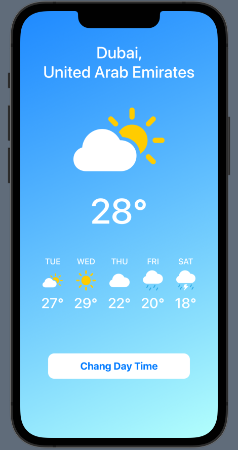
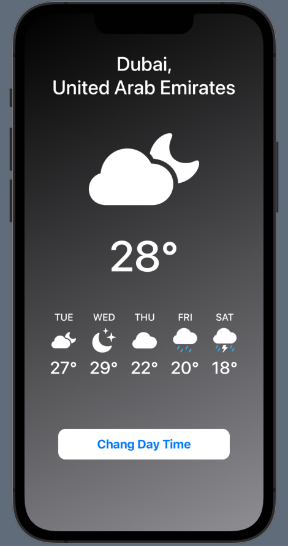
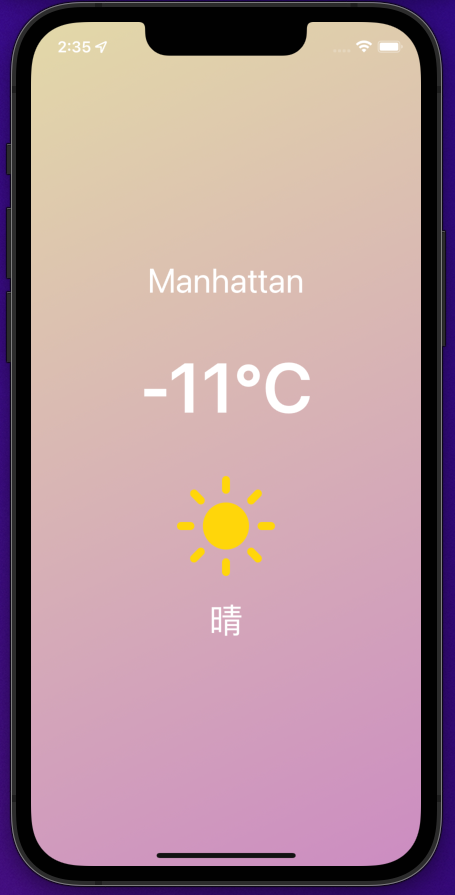
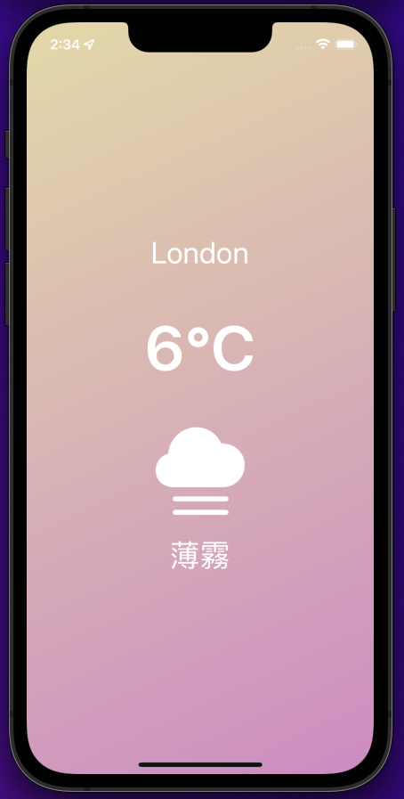

# MyWeather

This code is based on the following tutorials
[SwiftUI Basics Tutorial](https://www.youtube.com/watch?v=HXoVSbwWUIk) by [Sean Allen](https://www.youtube.com/channel/UCbTw29mcP12YlTt1EpUaVJw)
[SwiftUI Tutorial - Weather App](https://www.youtube.com/watch?v=DxYAhXLtAB0) by [Ale Patron](https://www.youtube.com/channel/UCvsJ3k3CFcRq3eJnUoU3u2w)

- Version 1(UI Design)

- Version 2(Fetch Openweathermap API with MVVM)

How to set your `API_KEY`: [Secure Secrets in iOS app](https://medium.com/swift-india/secure-secrets-in-ios-app-9f66085800b4)
